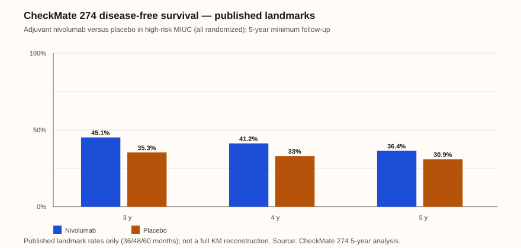

# Bladder / urothelial → Adjuvant urothelial

Last reviewed: 2026-09-23
Next review: 2026-12-22
Owner: GU clinic
Purpose: Disease → setting page for adjuvant urothelial-carcinoma decisions after radical surgery
Status: clinic-ready — perioperative EV+pembro and NIAGARA now change who still needs classic adjuvant IO; ctDNA MRD selects adjuvant atezo

## Who this applies to
- Post-cystectomy (or appropriately selected post-nephroureterectomy) with high-risk pathologic features (CheckMate 274: ypT2–T4a and/or ypN+ after neoadjuvant cisplatin, or pT3–T4a and/or pN+ without neoadjuvant chemo — exact eligibility in the protocol/label; restage from source if needed)[^1].
- Note neoadjuvant / perioperative exposure: prior EV+pembro or durvalumab changes adjuvant counseling (overlap, cumulative neuropathy, irAE)[^3][^4].
- Cisplatin eligibility, residual disease, margins, histology/variant, surgical recovery, and ctDNA MRD status if considering IMvigor011-path atezolizumab[^5][^6].

## Standard options

| Clinical context | Option | Key inclusion | Typical duration |
|---|---|---|---|
| High-risk disease after radical surgery without perioperative ICI | Nivolumab or observation[^1] | CheckMate 274-type risk and recovery[^1]. | One year in trial[^1]. |
| High-risk disease after radical surgery | Pembrolizumab or observation[^2] | AMBASSADOR DFS evidence; OS was not reported in the retrieved abstract[^2]. | One year in trial[^2]. |
| Post-cystectomy ctDNA MRD-positive disease | Atezolizumab pathway[^5] | IMvigor011/FDA companion-diagnostic setting[^5]. | Up to one year in trial[^5]. |
| Prior perioperative ICI/ADC or outside evidence | Individualize surveillance or trial[^3][^4] | Avoid untested second adjuvant ICI sequencing[^3][^5]. | Individualized[^5]. |
- If perioperative EV+pembro or NIAGARA already given or planned as the MIBC pathway: adjuvant counseling is part of that perioperative package, not a separate CheckMate 274 default[^3][^4].
- If high-risk after RC and no prior perioperative ICI: adjuvant nivolumab 240 mg q2wk ×1 year (CheckMate 274) vs observation vs trial[^1]. AMBASSADOR pembrolizumab 200 mg q3wk ×1 year is DFS-positive; OS not in the retrieved abstract[^2].
- If post-cystectomy ctDNA MRD+ by Signatera CDx (serial testing window per label): adjuvant atezolizumab (IMvigor011 / FDA 15 May 2026) — distinct from the negative unselected IMvigor010 trial[^5].
- Do not use adjuvant atezolizumab based on IMvigor010 (unselected high-risk)[^5].
- Observation remains reasonable when risk is lower, recovery is poor, ctDNA remains negative, or irAE risk is prohibitive[^5][^6].
- Upper-tract: CheckMate 274 enrolled MIUC including UTUC; do not invent UTUC-specific HRs — not separately reported in the retrieved abstracts[^1].

## Therapy sequencing

| Prior treatment or postoperative state | Next treatment order | Branch point / evidence boundary |
|---|---|---|
| Resectable MIBC selected for EV-303/EV-304 | Neoadjuvant EV plus pembrolizumab → cystectomy → protocol-defined adjuvant EV plus pembrolizumab[^4]. | This is one perioperative package; do not add separate adjuvant nivolumab by default after prior perioperative ICI/EV[^4][^1]. |
| Cisplatin-eligible MIBC selected for NIAGARA | Neoadjuvant durvalumab plus GC → cystectomy → adjuvant durvalumab[^3]. | NIAGARA likewise tests one perioperative package, not subsequent adjuvant-ICI switching[^3]. |
| High-risk disease after radical surgery without perioperative ICI | Adjuvant nivolumab or observation; pembrolizumab is a DFS-positive alternative in AMBASSADOR[^1][^2]. | Choose after recovery and immune-risk assessment; the trials do not establish serial PD-1/PD-L1 therapy[^1][^2]. |
| ctDNA MRD-positive after cystectomy | Atezolizumab up to one year in the IMvigor011/FDA companion-diagnostic pathway[^5]. | This is distinct from unselected IMvigor010, which was negative[^5]. |
| High-risk residual disease after perioperative EV plus pembrolizumab or NIAGARA | Surveillance or clinical trial discussion[^3][^4]. | A preferred salvage-adjuvant sequence is not established in the retrieved sources[^3][^5]. |

## Surveillance and treatment de-escalation

### Post-cystectomy imaging schedule (EAU practice framework)

| Time after cystectomy | Chest/abdomen/pelvis CT (incl. upper tract when indicated)[^6] | Notes[^6] |
|---|---|---|
| Every 6 months through 36 months[^6] | CT[^6] | Panel framework; intensify upper-tract monitoring if multifocal disease, CIS, or positive ureteral margins[^6] |
| Annually thereafter through ~60 months[^6] | CT[^6] | Consider stopping routine CT after 5 years in majority of patients without ongoing high-risk features[^6] |

| Phase | Monitoring cadence | Stop, hold, or de-escalate | Re-escalation / next line |
|---|---|---|---|
| Adjuvant nivolumab or pembrolizumab ×1 year | Labs and immune-symptom review each cycle; ctDNA serial testing if using IMvigor011 pathway[^1][^2][^5]. | Complete 1-year adjuvant course unless grade ≥3/4 immune toxicity; hold for immune events per label[^1][^2]. ctDNA-negative patients should not receive unselected adjuvant atezolizumab (IMvigor010 negative)[^5]. | ctDNA conversion or radiographic recurrence → systemic therapy; avoid untested second adjuvant ICI after perioperative EV/pembro or NIAGARA[^3][^4][^5]. |
| ctDNA MRD-positive adjuvant atezolizumab | ctDNA per companion-diagnostic schedule; immune monitoring[^5]. | Stop at 1 year or progression; hold for immune toxicity[^5]. | Progression → mUC systemic options[^5][^6]. |

- Prior perioperative EV plus pembrolizumab or NIAGARA completes the intended adjuvant component; separate CheckMate 274-style adjuvant ICI is not the default[^3][^4].
- Observation remains reasonable when risk is lower, recovery is poor, or prior perioperative ICI makes adjuvant PD-1 inappropriate; imaging follows the EAU schedule above[^1][^5][^6].

Published DFS landmarks only at 36, 48, and 60 months (nivolumab 45.1%, 41.2%, 36.4% vs placebo 35.3%, 33.0%, 30.9%); not a full KM reconstruction[^8].

## Landmark evidence

These rows mix perioperative (changes adjuvant need) and true adjuvant trials. Indirect comparison only[^5].

<!-- .cross_trial -->
| Trial | Population | Intervention arm | Control arm | Key outcomes (both arms) | Key HR | Evidence status |
|-------|------------|------------------|-------------|--------------------------|--------|-----------------|
| EV-303 / KEYNOTE-905 NCT03924895 | Cisplatin-ineligible or declined MIBC; RC+PLND candidates; N=344[^4] | Neoadjuvant EV 1.25 mg/kg d1,8 + pembro 200 mg q3wk ×3 → RC+PLND → adjuvant EV ×6 + pembro (17 total pembro cycles)[^4] | RC+PLND alone[^4] | 2-y EFS 74.7% vs 39.4%; 2-y OS 79.7% vs 63.1%; pCR 57.1% vs 8.6%; grade ≥3 AE 71.3% vs 45.9%[^4] | EFS HR 0.40 (0.28–0.57); OS HR 0.50 (0.33–0.74)[^4] | Vulsteke 2026 NEJM; FDA Padcev label cisplatin-ineligible[^4] |
| EV-304 / KEYNOTE-B15 NCT04700124 | Cisplatin-eligible MIBC; N=808[^4] | Neoadjuvant EV 1.25 mg/kg d1,8 + pembro 200 mg ×4 → RC+PLND → adjuvant EV ×5 + pembro ×13[^4] | Neoadjuvant cisplatin 70 mg/m² d1 + gemcitabine 1000 mg/m² d1,8 ×4 → RC[^4] | Median EFS NR vs 48.5 mo; 2-y EFS 79.4% vs 66.2%; 2-y OS 86.9% vs 81.3%; pCR 55.8% vs 32.5%; grade ≥3 AE 75.7% vs 67.2%[^4] | EFS HR 0.53 (0.41–0.70); OS HR 0.65 (0.48–0.89)[^4] | FDA Padcev label / EV-304 labeled perioperative use[^4] |
| NIAGARA NCT03732677 | Cisplatin-eligible MIBC; N=533 vs 530[^3] | Neoadjuvant durvalumab + GC q3wk ×4 → RC → adjuvant durvalumab q4wk ×8[^3] | Neoadjuvant GC ×4 → RC (no adjuvant)[^3] | 24-mo EFS 67.8% vs 59.8%; 24-mo OS 82.2% vs 75.2%; TRAE grade 3–4 40.6% vs 40.9%; RC 88.0% vs 83.2%. pCR % not in NEJM abstract; FDA summary: pCR not statistically different[^3] | EFS HR 0.68 (0.56–0.82); OS HR 0.75 (0.59–0.93)[^3] | Powles 2024 NEJM PMID 39282910[^3] |
| CheckMate 274 | High-risk MIUC after radical surgery; N=709[^1] | Adjuvant nivo 240 mg q2wk ×1 y[^1] | Placebo ×1 y[^1] | Primary median DFS 20.8 vs 10.8 mo[^1]. At ≥5-y minimum follow-up: median DFS 21.9 vs 11.0 mo (not a 5-y DFS %); DFS landmarks 45.1%/41.2%/36.4% vs 35.3%/33.0%/30.9% at 36/48/60 mo; median OS 75.0 vs 50.1 mo[^8]. | DFS HR 0.70 (98.22% CI 0.55–0.90) primary[^1]; 5-y DFS HR 0.74 (0.61–0.90); OS HR 0.83 (0.67–1.02)[^8] | Bajorin 2021 NEJM PMID 34077643[^1]; Galsky 2026 Ann Oncol PMID 41110694[^8] |
| AMBASSADOR A031501 NCT03244384 | High-risk MIUC after radical surgery; N=702[^2] | Adjuvant pembro 200 mg q3wk ×1 y[^2] | Observation[^2] | Median DFS 29.6 vs 14.2 mo; grade ≥3 AE 50.6% vs 31.6%. OS not in abstract[^2] | DFS HR 0.73 (0.59–0.90)[^2] | 2025 NEJM PMID 39282902[^2] |
| IMvigor010 NCT02450331 | High-risk MIUC after radical surgery; N=809[^5] | Adjuvant atezolizumab 1200 mg q3wk ×16 / 1 y[^5] | Observation[^5] | Primary DFS not met. Both-arm DFS medians not in retrieved abstract[^5] | DFS HR not in retrieved abstract[^5] | Unselected; do not use — guideline/practice boundary[^5] |
| IMvigor011 NCT04660344 | Post-cystectomy MIBC with ctDNA MRD+ (serial); N=250 (2:1)[^5] | Atezolizumab 1680 mg q4wk ≤12 cycles / 1 y[^5] | Placebo[^5] | Median DFS 9.9 vs 4.8 mo; median OS 32.8 vs 21.1 mo[^5] | DFS HR 0.64 (0.47–0.87); OS HR 0.59 (0.39–0.90)[^5] | FDA 15 May 2026; companion Signatera CDx — practice framing per guideline[^5] |

## Biomarkers

| Marker | Current clinic role | Emerging / investigational | How it changes decision now | Limits |
|---|---|---|---|---|
| PD-L1 | Not required for CheckMate 274 ITT DFS benefit[^1] | Larger DFS effect in PD-L1 ≥1% subgroup (primary DFS HR 0.55; 5-y DFS HR 0.58)[^1][^8] | Do not withhold nivolumab solely for PD-L1-negative disease based on ITT[^1]. | Subgroup enrichment is not a registration selector for adjuvant nivolumab[^1][^8]. |
| ctDNA MRD (Signatera) | Companion diagnostic selecting adjuvant atezolizumab after cystectomy (IMvigor011 / FDA)[^5] | CheckMate 274 5-year exploratory baseline ctDNA correlates with recurrence risk[^8] | Serial testing until positive or end of the recommended 12-month window selects the atezolizumab pathway[^5]. | Exploratory CheckMate 274 ctDNA is not the registration companion for nivolumab[^1][^8]. |
| Nectin-4 | Not an adjuvant IO selector in these trials[^1][^5] | Perioperative EV plus pembrolizumab context on neoadjuvant/mUC pages[^4] | No change to classic adjuvant IO choice on this page[^1][^5]. | Not used to select adjuvant nivolumab, pembrolizumab, or atezolizumab[^1][^5]. |
| HER2 | Not an adjuvant IO selector[^1][^5] | Metastatic / tumor-agnostic HER2 context elsewhere[^5] | No adjuvant decision change on this page[^1][^5]. | No validated adjuvant assay role here[^1][^5]. |
| FGFR | Not an adjuvant IO selector[^1][^5] | Metastatic FGFR3 / erdafitinib pathway[^5] | No adjuvant decision change on this page[^1][^5]. | Adjuvant setting does not use FGFR to select IO[^1][^5]. |

## Gene and cellular therapy

No FDA-approved CAR-T, TCR-T, TIL, gene-edited cell therapy, or oncolytic-virus product is standard after cystectomy for urothelial carcinoma on this page[^5][^6]. Intravesical nadofaragene firadenovec is labeled for BCG-unresponsive NMIBC and is not adjuvant systemic therapy here[^9]. Metastatic MAGE-A4 TCR-T (SURPASS, NCT04044859) may be relevant only at unresectable/metastatic relapse[^10].

| Role | Content |
|---|---|
| Current / approved clinic role | None for this adjuvant setting[^5][^6][^9]. |
| Emerging / investigational | No verified adjuvant gene/cellular practice-changing program in this source set; discuss metastatic cellular-therapy trials at relapse when criteria are met[^10]. |

## Upcoming research

Field direction: perioperative EV plus pembrolizumab and NIAGARA are reshaping who still needs classic adjuvant IO, while ctDNA MRD (IMvigor011) adds a biomarker branch; residual disease after perioperative therapy and dual EV/IO then MRD-positive pathways remain open questions[^3][^4][^5].

| Program or question | Why it may change care | Evidence status |
|---|---|---|
| AMBASSADOR overall survival | Clarifies whether adjuvant pembrolizumab DFS benefit translates to mature OS versus observation[^2]. | Peer-reviewed DFS report; OS follow-up pending in this pack[^2]. |
| High-risk yp residual disease after perioperative EV plus pembrolizumab or NIAGARA | Defines adjuvant or next systemic options when pathologic residual disease persists[^3][^4]. | Not answered in retrieved sources; treat as a care-changing evidence gap[^3][^4]. |
| Perioperative EV plus pembrolizumab then later ctDNA MRD positivity | Sequencing when both pathways apply[^4][^5]. | Not defined in retrieved sources[^4][^5]. |

## Toxicity

| Regimen and comparator | Trial-level safety outcomes | Counseling focus |
|---|---|---|
| Nivolumab versus placebo, CheckMate 274 | Grade ≥3 treatment-related AEs 17.9% vs 7.2%[^1]. | Promptly report cough/dyspnea, diarrhea, abdominal pain, rash, jaundice, fatigue, or endocrine symptoms; immune toxicity may require a hold, corticosteroids, or hormone replacement[^1]. |
| Pembrolizumab versus observation, AMBASSADOR | Grade ≥3 AEs 50.6% vs 31.6%[^2]. | Use the same immune-toxicity counseling; coordinate with recovery after radical surgery[^2]. |
| Perioperative EV plus pembrolizumab | Grade ≥3 AEs 71.3% vs 45.9% in EV-303 and 75.7% vs 67.2% in EV-304[^4]. | Report rash, neuropathy, visual symptoms, thirst/polyuria, or immune symptoms promptly[^4]. |
| Perioperative durvalumab plus GC | Grade 3–4 treatment-related AEs 40.6% vs 40.9% in NIAGARA[^3]. | Review fever/infection, cytopenias, renal and neuropathy symptoms, and immune toxicity[^3]. |

### On-treatment monitoring

| SOC/option regimen | Hallmark monitoring toxicity and available rate | Patient action / clinic response |
|---|---|---|
| Nivolumab, pembrolizumab, or atezolizumab adjuvant pathway | CheckMate 274 nivolumab: grade ≥3 treatment-related AEs 17.9% vs 7.2% with placebo[^1]. AMBASSADOR pembrolizumab: grade ≥3 AEs 50.6% vs 31.6% with observation[^2]. A comparable IMvigor011 named immune-event rate was not retrieved[^5]. | Before each dose, review bowel, lung, liver, thyroid/adrenal, and skin symptoms. Persistent diarrhea/abdominal pain, cough/dyspnea, jaundice, marked fatigue, or palpitations needs prompt contact; immune events may require holding treatment, corticosteroids, or lasting hormone replacement[^1][^2]. |
| Perioperative EV plus pembrolizumab | EV-303 FDA-label treatment-arm rates (single-arm label rates; no paired comparator % in the retained label table): rash 54%, grade 3–4 7%; neuropathy 39%, grade 3–4 3%; increased glucose 72%, grade 3–4 12%[^4]. EV-304: rash 63%, grade 3–4 12%; neuropathy 43%, grade 3–4 3%; hyperglycemia 20%, grade 3–4 7%[^4]. Trial-level grade ≥3 AEs 71.3% vs 45.9% with RC+PLND alone (EV-303) and 75.7% vs 67.2% with neoadjuvant GC (EV-304)[^4]. | Monitor cumulative neuropathy, glucose symptoms, skin, vision, renal function, and immune toxicity before postoperative doses; new numbness/weakness, thirst/polyuria, rash, vision change, dyspnea, or persistent diarrhea requires prompt assessment[^4]. |
| Perioperative durvalumab plus GC | NIAGARA grade 3–4 treatment-related AEs 40.6% vs 40.9% with neoadjuvant GC alone; a comparable named monitoring rate was not extracted[^3]. | Monitor CBC, renal function, electrolytes, neuropathy/hearing, and immune symptoms; fever, infection symptoms, reduced urine output, dyspnea, or severe diarrhea needs urgent assessment[^3]. |

## Guideline references

- [NCCN Bladder Cancer](https://www.nccn.org/guidelines/guidelines-detail?category=1&id=1417)
- [EAU Muscle-invasive and metastatic bladder cancer guideline](https://uroweb.org/guidelines/muscle-invasive-and-metastatic-bladder-cancer)
- [ESMO bladder cancer guideline](https://www.esmo.org/guidelines/esmo-clinical-practice-guideline-bladder-cancer)

## Sources

1. [Bajorin et al. (2021). CheckMate 274. *New England Journal of Medicine*. PMID: 34077643](https://pubmed.ncbi.nlm.nih.gov/34077643/)
2. [Apolo et al. (2025). AMBASSADOR. *New England Journal of Medicine*. PMID: 39282902](https://pubmed.ncbi.nlm.nih.gov/39282902/)
3. [Powles et al. (2024). NIAGARA. *New England Journal of Medicine*. PMID: 39282910](https://pubmed.ncbi.nlm.nih.gov/39282910/)
4. [FDA Padcev label, revised 2026](https://www.accessdata.fda.gov/drugsatfda_docs/label/2026/761137s037lbl.pdf)
5. [NCCN Bladder Cancer](https://www.nccn.org/guidelines/guidelines-detail?category=1&id=1417)
6. [EAU Muscle-invasive and metastatic bladder cancer guideline](https://uroweb.org/guidelines/muscle-invasive-and-metastatic-bladder-cancer)
7. [ESMO bladder cancer guideline](https://www.esmo.org/guidelines/esmo-clinical-practice-guideline-bladder-cancer)
8. [Galsky et al. (2026). CheckMate 274 5-year efficacy and ctDNA. *Annals of Oncology*. PMID: 41110694](https://pubmed.ncbi.nlm.nih.gov/41110694/)

9. [FDA Adstiladrin (nadofaragene firadenovec) label / DailyMed — BCG-unresponsive NMIBC indication](https://dailymed.nlm.nih.gov/dailymed/drugInfo.cfm?setid=5ca20ed4-da4f-463c-ac2a-ccd6ab3774fa)
10. [ClinicalTrials.gov NCT04044859 (SURPASS / ADP-A2M4CD8)](https://clinicaltrials.gov/study/NCT04044859)

## Changelog
- 2026-09-23: Added Gene and cellular therapy section (after Biomarkers, before Upcoming research); clinic vs investigational framing; no approved GU solid-tumor CAR-T/TCR/TIL products in these settings.
- 2026-09-22: Replaced surveillance with EAU post-cystectomy CT every 6 months ×3 years then annual through ~60 months; added CheckMate 274 DFS landmark figure and Source #8; clarified median DFS vs landmark % in the landmark table; expanded Biomarkers to five-column table; mirrored EAU cadence in paired dotphrase.
- 2026-09-22: Renamed Upcoming trial results to Upcoming research; reframed for ongoing trials and field direction.
- 2026-09-22: Named placebo/observation/GC/surgery comparators in monitoring rates and labeled EV FDA rates as single-arm; mirrored comparator-named counseling in the paired dotphrase.
- 2026-09-22: Added line-level source superscripts ([^n]) linked to numbered Sources.
- 2026-09-22: Added Surveillance and treatment de-escalation section; strengthened quantified benefit counseling in dotphrase.
- 2026-09-21: Added EV-303 and EV-304 FDA-label neuropathy, glucose, and rash monitoring rates to the perioperative row.
- 2026-09-21: Added treatment sequencing and regimen-level on-treatment monitoring, including the IMvigor011 safety-reporting boundary.
- 2026-09-21: Renamed the prospective-evidence section to Upcoming trial results.
- 2026-09-21: Removed Bottom line; added a compact Guidelines table and disease → setting page framing. No treatment recommendations or trial statistics changed.
- 2026-09-21: filled EV-304 FDA approval (10 Jul 2026 — all MIBC cystectomy candidates); added IMvigor011 / Signatera ctDNA MRD adjuvant atezolizumab (FDA 15 May 2026) and clarified IMvigor010 remains negative for unselected adjuvant atezo
- 2026-09-14: expanded from stub; landscape table includes EV-303, EV-304 (now published), NIAGARA, CheckMate 274 5-year, AMBASSADOR, IMvigor010; perioperative SOC explicitly changes adjuvant counseling
- 2026-09-14: initial stub
