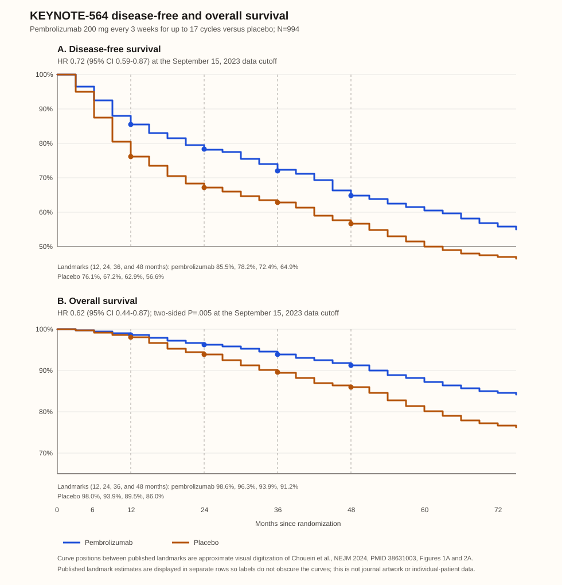

# RCC → Adjuvant clear-cell RCC

Last reviewed: 2026-09-21
Next review: 2026-12-20
Owner: GU clinic
Purpose: Post-nephrectomy shared decision support for adjuvant clear-cell RCC
Status: current — pembrolizumab has randomized DFS and OS benefit; in the US, pembrolizumab plus belzutifan is FDA-labeled with immature OS

## Who this applies to

### KEYNOTE-564 eligibility and decision boundary

| Risk group | Exact trial definition | Adjuvant discussion |
|---|---|---|
| Intermediate-high risk | Clear-cell RCC: pT2 grade 4 or sarcomatoid, N0 M0; or pT3 any grade, N0 M0 | Discuss pembrolizumab and risk-adapted surveillance. |
| High risk | Clear-cell RCC: pT4 any grade, N0 M0; or any pT, any grade, N+ M0 | Discuss pembrolizumab and risk-adapted surveillance. |
| M1 NED | Primary tumor plus solid, isolated, soft-tissue, nonbone/nonbrain metastasis completely resected with negative margins synchronously or within 1 year after nephrectomy; NED at baseline | Discuss in a multidisciplinary setting; the subgroup is small and should not be treated as equivalent to M0 cohorts. |
| Lower-risk clear-cell RCC | Does not meet a trial risk definition | Use risk-adapted surveillance; do not extend the trial result to lower-risk disease. |
| Non-clear-cell RCC | Outside the KEYNOTE-564 population | Do not extrapolate the pembrolizumab result; discuss surveillance or a clinical trial. |

- KEYNOTE-564 required nephrectomy and, when relevant, metastasectomy within 12 weeks before randomization. This is trial eligibility, not a universal treatment-start mandate.
- Confirm histology, pT/pN stage, grade, sarcomatoid features, margin status, surgery date, NED status, recovery, renal function, autoimmune history, and baseline endocrinopathy before deciding.

## Standard options

| Circumstance | Option | Shared-decision discussion | Typical course |
|---|---|---|---|
| KEYNOTE-564–eligible clear-cell RCC | Pembrolizumab | Randomized benefit was versus placebo, not surveillance. Discuss the DFS/OS results, immune-related toxicity, and possibility of overtreatment. | Trial regimen: 200 mg IV every 3 weeks for up to 17 cycles. The [current US label](https://www.accessdata.fda.gov/drugsatfda_docs/label/2026/125514s194lbl.pdf) also permits 400 mg IV every 6 weeks. |
| US adult with intermediate-high/high-risk clear-cell RCC or qualifying M1 NED | Pembrolizumab plus belzutifan | FDA-labeled in the US. [LITESPARK-022](https://pubmed.ncbi.nlm.nih.gov/42384869/) showed a DFS benefit over pembrolizumab plus placebo, but OS was immature and grade ≥3 treatment-emergent AEs were more frequent. Do not present it as OS-proven or interchangeable with pembrolizumab alone. | Pembrolizumab 200 mg IV every 3 weeks or 400 mg IV every 6 weeks plus belzutifan 120 mg orally daily; up to 1 year per label. |
| Eligible patient preferring no adjuvant systemic therapy, or with competing risk/frailty/major immune-risk concern | Risk-adapted surveillance | Active management option; use postoperative imaging and functional follow-up individualized to recurrence risk, renal function, and preferences. | Ongoing |
| Non-clear-cell RCC or a patient outside the pivotal population | Clinical trial or risk-adapted surveillance | There is no KEYNOTE-564 direct-evidence basis to select pembrolizumab. | Protocol or ongoing |

### EAU timing after restaging—not trial eligibility

The [EAU RCC guideline](https://uroweb.org/guidelines/renal-cell-carcinoma/chapter/disease-management) strongly recommends offering adjuvant pembrolizumab after restaging, preferably 12–16 weeks after nephrectomy, to patients with KEYNOTE-564-defined risk. It also directs shared discussion of the discordant adjuvant-ICI trials, overtreatment, and immune-related adverse effects.

## Landmark evidence

### KEYNOTE-564: practice-changing DFS and OS

Approximate source-recreated full Kaplan–Meier traces digitized from the published KEYNOTE-564 DFS and OS figures at the September 15, 2023 data cutoff; no journal artwork or individual-patient data are reproduced. Exact published 12-, 24-, 36-, and 48-month estimates are labeled. Intermediate curve positions are approximate visual digitization and must not be read as reported landmark estimates.

| Trial | Population, randomization, and endpoint | Key published outcome | Clinical interpretation |
|---|---|---|---|
| [KEYNOTE-564](https://pubmed.ncbi.nlm.nih.gov/38631003/), NCT03142334 | 994 clear-cell RCC; 496 pembrolizumab and 498 placebo; 1:1 double-blind; primary endpoint investigator-assessed DFS | At 57.2 months’ median follow-up, DFS HR 0.72 (95% CI 0.59–0.87); 48-month DFS 64.9% versus 56.6%. OS HR 0.62 (95% CI 0.44–0.87; P=.005); 48-month OS 91.2% versus 86.0%. | Randomized DFS and OS benefit in the eligible population; placebo was the trial comparator. |
| [KEYNOTE-564 5-year update](https://pubmed.ncbi.nlm.nih.gov/42648402/) | Fourth prespecified analysis; 70-month median follow-up | 5-year DFS 60.9% versus 52.2%; HR 0.71 (95% CI 0.59–0.86). 5-year OS 87.7% versus 82.3%; HR 0.66 (95% CI 0.48–0.90). | Later data cutoff than the figure; reported separately rather than merged into its curves. |
| [LITESPARK-022](https://pubmed.ncbi.nlm.nih.gov/42384869/), NCT05239728 | 1,841 randomized: pembrolizumab plus belzutifan (n=921) versus pembrolizumab plus placebo (n=920); primary endpoint DFS | 24-month DFS 80.7% versus 73.7%; HR 0.72 (95% CI 0.59–0.87; P<.001). At 29% of planned OS events, OS HR 0.78 (95% CI 0.51–1.19; P=.24). | DFS-positive against pembrolizumab alone; OS is immature and no statistically significant between-group difference was shown at this analysis. |
| [IMmotion010](https://pubmed.ncbi.nlm.nih.gov/36099926/) | 778 RCC; adjuvant atezolizumab versus placebo; investigator-assessed DFS | DFS HR 0.93 (95% CI 0.75–1.15; P=.50). | Negative primary analysis; does not establish a PD-L1 inhibitor effect in this setting. |
| [CheckMate 914 Part A](https://pubmed.ncbi.nlm.nih.gov/36774933/) / [Part B](https://pubmed.ncbi.nlm.nih.gov/39303200/) | Part A: 816 localized ccRCC, nivolumab plus ipilimumab versus placebo. Part B: separate 825-participant cohort, nivolumab versus placebo. | Part A BICR DFS HR 0.92 (95% CI 0.71–1.19; P=.53). Part B BICR DFS HR 0.87 (95% CI 0.62–1.21; P=.40). | Negative primary analyses; do not assume a pembrolizumab class effect. |
| [PROSPER ECOG-ACRIN EA8143](https://pubmed.ncbi.nlm.nih.gov/38942046/) | 819 RCC; perioperative nivolumab strategy versus surgery and observation; investigator-reviewed RFS | RFS HR 0.94 (95% CI 0.74–1.21; one-sided P=.32); stopped for futility. | Perioperative, not adjuvant-only; negative primary analysis. |

## Biomarkers

| Marker or feature | Role now | Practical boundary |
|---|---|---|
| Clear-cell component and KEYNOTE-564 risk features | Direct-evidence selection | Confirm on nephrectomy pathology; do not substitute a prognostic score for the pivotal eligibility definition. |
| PD-L1 | Not a routine adjuvant selector | No validated threshold selects who benefits from adjuvant pembrolizumab. |
| ctDNA / molecular residual disease | Investigational | Do not withhold adjuvant therapy because MRD is negative outside a trial. [MRD GATE RCC](https://clinicaltrials.gov/study/NCT06005818) is testing an MRD-guided strategy in KEYNOTE-564–eligible clear-cell RCC. |
| Tumor genomic or expression signature | Investigational | No validated molecular assay selects adjuvant pembrolizumab in this setting. |
| Germline evaluation | Hereditary-risk assessment, not adjuvant selection | Consider when age, bilateral/multifocal disease, family history, or syndrome features raise concern. |

## Toxicity anchors

| Counseling anchor | Evidence and practical discussion |
|---|---|
| Pembrolizumab benefit-risk | In the [57.2-month KEYNOTE-564 analysis](https://pubmed.ncbi.nlm.nih.gov/38631003/), grade 3–4 treatment-related AEs were 18.6% versus 1.2%, and serious all-cause AEs 20.7% versus 11.5%, with pembrolizumab versus placebo. |
| Treatment discontinuation and steroids | At the [30-month analysis](https://pubmed.ncbi.nlm.nih.gov/36055304/), AEs led to discontinuation in 21% versus 2%; immune-mediated AEs occurred in 36% versus 7%; high-dose systemic corticosteroids were used in 8% versus 1%. |
| Immune-mediated toxicity | Discuss thyroid, adrenal/pituitary, hepatic, bowel, lung, renal, and diabetes toxicity; endocrinopathy or organ injury can persist after treatment. New pulmonary, gastrointestinal, hepatic, endocrine, or renal symptoms need prompt assessment. |
| Baseline and on-treatment checks | Review autoimmune disease, immunosuppression, and baseline endocrinopathy. Check CBC, creatinine/liver tests, and thyroid function per local protocol and the [current label](https://www.accessdata.fda.gov/drugsatfda_docs/label/2026/125514s194lbl.pdf). In a post-nephrectomy patient, promptly evaluate a creatinine rise rather than assuming treatment causality. |
| Pembrolizumab plus belzutifan | In [LITESPARK-022](https://pubmed.ncbi.nlm.nih.gov/42384869/), grade ≥3 treatment-emergent AEs among treated participants were 52.1% with pembrolizumab plus belzutifan versus 30.2% with pembrolizumab plus placebo. Follow the label for monitoring and dose modification; OS remains immature. |

## Watch list

| Trial or publication | Why it may change care | Evidence status |
|---|---|---|
| [LITESPARK-022](https://pubmed.ncbi.nlm.nih.gov/42384869/) mature follow-up | Clarifies whether the established DFS advantage of pembrolizumab plus belzutifan over pembrolizumab alone becomes an OS advantage and how durable the added toxicity is. | Peer-reviewed phase 3 publication; OS immature at the reported analysis. Study follow-up remains active. |
| [RAMPART](https://pubmed.ncbi.nlm.nih.gov/39555240/), NCT03288532 | Tests adjuvant durvalumab alone or with tremelimumab against active monitoring in resected RCC, including non-clear-cell disease; longer follow-up may contextualize the discordant ICI-trial results. | Phase 3 platform. Enrollment closed in June 2023; congress reporting and OS follow-up are pending peer-reviewed maturity. |
| [MRD GATE RCC](https://clinicaltrials.gov/study/NCT06005818), NCT06005818 | Tests whether an MRD-guided strategy can safely observe MRD-negative, otherwise KEYNOTE-564–eligible clear-cell RCC while treating MRD-positive participants with pembrolizumab. | Recruiting, nonrandomized phase 2; no efficacy results. |
| [STRIKE](https://clinicaltrials.gov/study/NCT06661720), NCT06661720 | Phase 3 test of adding tivozanib to adjuvant pembrolizumab for high-risk RCC. | Registry-posted trial; no efficacy results. |

## Guideline references

| Source | Setting-level reference |
|---|---|
| [EAU Renal Cell Carcinoma guideline](https://uroweb.org/guidelines/renal-cell-carcinoma/chapter/disease-management) | Strong recommendation to offer adjuvant pembrolizumab after restaging, preferably 12–16 weeks post-nephrectomy, for KEYNOTE-564-defined clear-cell risk; shared decision-making should address overtreatment, immune toxicity, and discordant ICI trials. |
| [NCCN Kidney Cancer guideline](https://www.nccn.org/guidelines/guidelines-detail?category=1&id=1440) | Current US professional guideline reference for adjuvant systemic-therapy pathways. |
| [ESMO RCC Clinical Practice Guideline](https://doi.org/10.1016/j.annonc.2024.05.537) | Current European guideline reference for diagnosis, treatment, and follow-up. |
| [AUA localized renal mass guideline](https://pubmed.ncbi.nlm.nih.gov/34115531/) | US urology reference for localized-RCC management and follow-up. |
| [FDA Keytruda label, revised July 2026](https://www.accessdata.fda.gov/drugsatfda_docs/label/2026/125514s194lbl.pdf) | US labeled adjuvant pembrolizumab monotherapy and pembrolizumab–belzutifan indications and dosing. |

## Sources

- [Choueiri et al. (2021). Adjuvant pembrolizumab after nephrectomy in renal-cell carcinoma. *New England Journal of Medicine*. DOI: 10.1056/NEJMoa2106391 | PMID: 34407342](https://pubmed.ncbi.nlm.nih.gov/34407342/)
- [Choueiri et al. (2024). Overall survival with adjuvant pembrolizumab in renal-cell carcinoma. *New England Journal of Medicine*. DOI: 10.1056/NEJMoa2312695 | PMID: 38631003](https://pubmed.ncbi.nlm.nih.gov/38631003/)
- [Haas et al. (2026). Five-year KEYNOTE-564 results. *Annals of Oncology*. DOI: 10.1016/j.annonc.2026.08.006 | PMID: 42648402](https://pubmed.ncbi.nlm.nih.gov/42648402/)
- [Choueiri et al. (2026). Adjuvant pembrolizumab plus belzutifan for renal-cell carcinoma. *New England Journal of Medicine*. DOI: 10.1056/NEJMoa2518245 | PMID: 42384869](https://pubmed.ncbi.nlm.nih.gov/42384869/)
- [Pal et al. (2022). IMmotion010. *Lancet*. DOI: 10.1016/S0140-6736(22)01658-0 | PMID: 36099926](https://pubmed.ncbi.nlm.nih.gov/36099926/); [Motzer et al. (2023). CheckMate 914 Part A. *Lancet*. DOI: 10.1016/S0140-6736(22)02574-0 | PMID: 36774933](https://pubmed.ncbi.nlm.nih.gov/36774933/); [Allaf et al. (2024). PROSPER. *Lancet Oncology*. DOI: 10.1016/S1470-2045(24)00278-9 | PMID: 38942046](https://pubmed.ncbi.nlm.nih.gov/38942046/)
- [EAU Renal Cell Carcinoma guideline](https://uroweb.org/guidelines/renal-cell-carcinoma/chapter/disease-management); [NCCN Kidney Cancer guideline](https://www.nccn.org/guidelines/guidelines-detail?category=1&id=1440); [ESMO RCC guideline](https://doi.org/10.1016/j.annonc.2024.05.537); [AUA renal mass guideline](https://pubmed.ncbi.nlm.nih.gov/34115531/); [FDA Keytruda label](https://www.accessdata.fda.gov/drugsatfda_docs/label/2026/125514s194lbl.pdf).

## Changelog

- 2026-09-21: Rebuilt around explicit KEYNOTE-564 eligibility, trial-versus-guideline timing, linked primary sources, current FDA-labeled pembrolizumab–belzutifan positioning, a named-trial watch list, and a complete paired counseling phrase.
- 2026-09-21: Replaced landmark-only survival display with full source-recreated DFS/OS KM traces, explicitly labeling visual digitization as approximate and keeping later five-year estimates separate.
