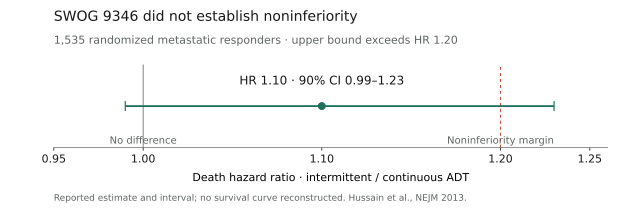

# Prostate → mHSPC

Last reviewed: 2026-10-05
Next review: 2027-01-03
Owner: GU clinic
Purpose: Disease → setting page for metastatic hormone-sensitive prostate cancer
Status: Intermittent-ADT claims and citations audited against primary sources 2026-10-05; other sections retain the 2026-09-22 review. NCCN text was not retrieved in this update.

## Who this applies to
- Synchronous or metachronous metastatic hormone-sensitive prostate cancer (mHSPC / mCSPC / mAPMN/S)[^13].
- Subclassify: high vs low volume (CHAARTED-style)[^10], de novo vs recurrent, visceral disease, fitness for docetaxel, PSMA PET status, BRCA2/HRR[^4], PTEN IHC[^12], comorbidities (hepatic, cardiac, falls).

## Standard options

| Clinical group | Option | Key inclusion | Typical course |
|---|---|---|---|
| Most fit patients with mHSPC | ADT plus ARPI doublet[^5][^6][^7][^8][^9] | Confirm metastatic hormone-sensitive state and comorbidity profile[^13]. | Continue per regimen until progression or unacceptable toxicity[^13]. |
| Chemo-fit, de novo high-volume/high-risk disease | ADT plus ARPI plus docetaxel discussion[^1][^2] | ARASENS/PEACE-1 populations; triplets were not compared with every modern doublet[^1][^2]. | Protocol- and regimen-specific[^1][^2]. |
| PSMA-positive or biomarker-defined population | Labeled radioligand or biomarker-directed combination[^3][^4][^12] | Match exact imaging or companion-diagnostic criteria[^3][^4][^12]. | Label-specific[^3][^4][^12]. |
- Fit, most patients: ADT + ARPI doublet (ARANOTE, ARCHES, ENZAMET, TITAN, LATITUDE, STAMPEDE abi)[^5][^8][^9][^6][^7][^11].
- Fit, high-volume / high-risk, chemo-fit: discuss ADT + ARPI ± docetaxel. ARASENS and PEACE-1 are triplets vs ADT+docetaxel ± placebo/no abi, not vs modern doublet[^1][^2].
- PSMA+ and candidate for radioligand: ADT + ARPI + 177Lu-PSMA-617 7.4 GBq q6wk × up to 6 (PSMAddition / FDA)[^3].
- BRCA2 (FDA): ADT + Akeega (niraparib 200 mg + abiraterone 1000 mg) + prednisone 5 mg daily. Do not treat every non-BRCA2 HRR hit as equivalent (FDA exploratory non-BRCA2m rPFS HR 0.88, CI crosses 1)[^4].
- PTEN-deficient by FDA-authorized IHC (VENTANA PTEN SP218): ADT + capivasertib 400 mg BID 4 days on / 3 off + abiraterone 1000 mg + prednisone 5 mg daily (CAPItello-281 / FDA 12 Jun 2026). OS immature — shared decision[^12].
- Local therapy: prostate RT / metastasis-directed therapy in selected low-volume / oligometastatic cases — coordinate with rad onc / urology. PEACE-1 RT interaction was not significant in the abi analysis; RT-specific coprimary details are not in this brief’s sources[^2][^14].

## Therapy sequencing

| Starting point or branch | Preferred order | Evidence boundary |
|---|---|---|
| Newly diagnosed or recurrent mHSPC | Start ADT plus an ARPI doublet for most fit patients[^5][^6][^7][^8][^9]. | The pivotal doublet trials are not head-to-head comparisons that select one ARPI for every patient[^13]. |
| De novo high-volume/high-risk and chemotherapy fit | Discuss ADT plus ARPI plus docetaxel rather than adding docetaxel after a doublet has failed[^1][^2]. | ARASENS and PEACE-1 tested treatment intensification at mHSPC presentation, not delayed triplet escalation[^1][^2]. |
| PSMA-positive disease eligible for radioligand | ADT plus ARPI → add 177Lu-PSMA-617 as the PSMAddition regimen[^3]. | This is an mHSPC intensification pathway; prior radioligand exposure changes future marrow and sequencing assessment[^3]. |
| BRCA2-mutated or PTEN-deficient disease | Use the specifically labeled biomarker-directed ADT combination at mHSPC presentation when appropriate[^4][^12]. | Do not generalize Akeega to non-BRCA2 HRR alterations or capivasertib to PTEN-unselected disease[^4][^12]. |
| Progression with castrate testosterone | Continue ADT and enter the mCRPC pathway with a full record of ARPI, docetaxel, radioligand, and biomarker-directed exposure[^13]. | This page does not establish a preferred sequence after mHSPC intensification[^13]. |

## Surveillance and treatment de-escalation

### Intermittent ADT in mCSPC

- Continuous ADT-based combination therapy remains the standard. EAU states that intermittent ADT has been superseded by continuous combination treatment; survival equivalence in metastatic disease remains unproven. The 2026 AUA/SUO panel generally advises against intermittent ADT in mHSPC[^14][^28].
- A-DREAM supplies prospective evidence that some exceptional responders can have a meaningful treatment-free interval after ADT plus an androgen-receptor pathway inhibitor (ARPI). It is a small, single-arm phase 2 study; it cannot establish survival equivalence to continued treatment[^20][^21].

| Situation | Decision supported by the evidence | Boundary |
|---|---|---|
| Routine mCSPC treatment | Continue ADT plus the indicated combination[^14]. | The pivotal combination evidence uses continuous ADT[^14]. |
| Exceptional response; substantial treatment burden; considering a break | Discuss trial participation and the A-DREAM eligibility and monitoring framework[^20][^22]. | Clinical interpretation: a selected-patient discussion, not an established replacement for continuous therapy; no randomized survival comparison[^20][^21]. |
| Low-volume / oligometastatic disease | Discuss local therapy in the appropriate multidisciplinary setting[^23]. | EXTEND tested adding metastasis-directed therapy (MDT) to intermittent hormone therapy; it did not compare intermittent with continuous therapy[^23]. |
| Nonmetastatic PSA recurrence after radiotherapy | PR.7 supports an intermittent strategy in its enrolled population[^18]. | This is adjacent evidence; do not transfer its noninferiority result to mCSPC[^17][^18]. |

### Published interruption protocols

These are trial-specific schedules and thresholds, not interchangeable prescribing rules[^16][^22][^24][^25].

| Protocol | Who entered the interruption phase | What stops / continues | Surveillance and restart |
|---|---|---|---|
| SWOG 9346 — historical | Stable/falling PSA ≤4 ng/mL at months 6 and 7 of LHRH-agonist plus older antiandrogen induction[^16]. | Stop hormonal treatment; subsequent cycles permitted if response criteria recur[^16]. | Monthly PSA; assessment every 3 months. Restart at PSA 20 ng/mL (or pretreatment baseline if lower); earlier at PSA 10 or symptoms at investigator discretion. Rising PSA by month 3 of a break required continuous treatment[^16]. |
| A-DREAM — investigational | 18–24 months ADT; ≥12 months ARPI; PSA <0.2 ng/mL, stable/falling over 3 consecutive same-laboratory measurements; testosterone <50 ng/dL. No liver/brain metastases[^21][^22]. | Stop both ADT and ARPI[^22]. | Clinical assessment, PSA/testosterone and labs every 3 months; CT/MRI chest/abdomen/pelvis plus bone scan every 6 months, with 3-month interim imaging recommended for rising PSA. Restart for PSA ≥5 ng/mL, radiographic progression or cancer-related symptoms[^22]. |
| LIBERTAS — investigational | PSA <0.2 ng/mL after 6 months apalutamide plus ADT[^24]. | Interrupt ADT; apalutamide continues[^24]. | Protocol restart triggers include new/worsening cancer symptoms, PSA >10 ng/mL (or pretreatment baseline if lower), or PSA doubling time <6 months[^27]. |
| EORTC 2238 DE-ESCALATE — investigational | PSA ≤0.2 ng/mL after 6–12 months ADT plus ARPI[^25]. | Interrupt both ADT and ARPI[^25]. | Restart at investigator discretion for significant PSA increase; the registry permits another interruption once PSA <0.2 ng/mL[^25]. |

Clinical interpretation: before an off-protocol discussion, document the disease extent, response duration, exact drugs being interrupted, patient priorities, monitoring plan and explicit restart triggers. A low PSA alone does not establish that interruption preserves survival[^14][^20][^22].

| Setting | PSA | Imaging | Stop/de-escalate | Re-escalate |
|---|---|---|---|---|
| On ADT plus ARPI or triplet[^13] | PSA and testosterone every 3 months; CBC/CMP and regimen-specific labs per label[^13][^14]. | Cross-sectional imaging every 6–12 months or for symptoms[^13][^14]. | Continue systemic therapy until radiographic or clinical progression or unacceptable toxicity; hold individual agents for toxicity rather than stopping ADT. Fixed-cycle components (docetaxel ×6, 177Lu-PSMA-617 up to 6 doses) complete per protocol then continue the remaining backbone[^1][^3][^13]. | Castration-resistant progression on conventional or PSMA imaging → mCRPC pathway with full prior-exposure documentation[^13]. |
| After completing fixed-cycle intensification[^13] | Same PSA/testosterone every-3-month cadence; marrow and renal monitoring after radioligand or taxane exposure[^3][^13]. | Same risk-adapted 6–12 month or symptom-triggered imaging[^13][^14]. | Do not stop ADT at progression to CRPC[^13]. | See Therapy sequencing for biomarker-directed and next-line options[^4][^12][^13]. |

- Risk-adapted imaging follows EAU/NCCN frameworks: low burden may extend imaging intervals when clinically appropriate; symptomatic or PSA-rise triggers restaging[^13][^14].
- PSMA PET may refine oligometastatic/local therapy decisions but does not replace castration assessment or conventional progression evaluation when clinically indicated[^3][^14].

## Landmark evidence

Cross-trial comparisons are indirect. Source access and endpoint-specific confidence levels are identified below and in Sources.

### Intermittent-therapy evidence

The SWOG primary interval is 90%; the PR.7 and EXTEND intervals below are 95%. The A-DREAM primary registry interval is 80%. These endpoints and populations should not be ranked against one another[^16][^18][^21][^23].

<!-- .cross_trial -->
| Trial | Population | Intervention | Comparator | Primary endpoint | Clinically meaningful outcomes | Generalizability-critical differences |
|---|---|---|---|---|---|---|
| SWOG 9346; phase 3 | 1,535 metastatic responders in the primary analysis (770 intermittent; 765 continuous)[^16]. | Intermittent LHRH agonist plus older antiandrogen after 7-month induction (goserelin/bicalutamide or equivalents)[^16]. | Continuous hormonal treatment with the same backbone[^16]. | Coprimary: overall survival (OS; noninferiority margin HR 1.20) and 3-month quality of life[^16]. | Median OS 5.1 vs 5.8 years; death HR 1.10 (90% CI 0.99–1.23). Noninferiority not established[^16]. | Pre-modern-ARPI treatment; result inconclusive, not proof of either equivalence or significant inferiority[^16]. |
| A-DREAM / Alliance A032101; phase 2 | 78 eligible exceptional responders to ADT plus ARPI[^20][^21]. | Stop both drugs[^22]. | None: single-arm[^20]. | Treatment-free at 18 months with testosterone recovery to study threshold ≥150 ng/dL[^21]. | 32/78 (41.0%); registry 80% CI 33.1–48.9%. ASCO abstract: 45/78 (58%) treatment-free regardless of testosterone; 52/78 (67%) recovered testosterone[^20][^21]. | Highly selected; no randomized control; abstract median follow-up 21.2 months. OS preservation not demonstrated; the study threshold is not a general definition of normal testosterone[^20][^21]. |
| PR.7; phase 3 | 1,386 patients with PSA >3 ng/mL, >1 year after primary/salvage radiotherapy; no distant metastases[^18]. | LHRH agonist in 8-month cycles plus nonsteroidal antiandrogen for ≥4 weeks each cycle[^18]. | Continuous LHRH agonist plus antiandrogen for ≥4 weeks, or orchiectomy[^18]. | OS noninferiority; margin HR 1.25[^18]. | Median OS 8.8 vs 9.1 years; HR 1.02 (95% CI 0.86–1.21); noninferior in this population[^18]. | M0 biochemical recurrence; does not resolve the metastatic question[^17][^18]. |
| EXTEND; randomized phase 2 | 87 men with ≤5 metastases; intermittent-hormone basket[^23]. | Definitive radiation to all metastases plus intermittent hormone therapy[^23]. | Intermittent hormone therapy alone[^23]. | Progression-free survival (PFS)[^23]. | Median PFS not reached vs 15.8 months; HR 0.25 (95% CI 0.12–0.55)[^23]. | Planned hormone break at 6 months in both arms; tests MDT addition, not interruption safety versus continuous therapy. Abstract-only retrieval; no inference of a pure mCSPC cohort or uniform modern ARPI regimen[^23]. |

Source-recreated interval summary, not a Kaplan–Meier curve. The upper bound crosses the prespecified margin, so a 20% higher death hazard cannot be excluded; the interval also includes 1.00[^16][^17].

### Low disease burden does not establish interruption safety

- SWOG’s exploratory minimal-disease subgroup had median OS 5.4 years with intermittent versus 6.9 years with continuous treatment (HR 1.19; 95% CI 0.98–1.43). “Minimal” meant metastases confined to spine, pelvic bones or nodes, not the CHAARTED low-volume definition. Interpretation: this subgroup result does not identify a population in which survival equivalence is established[^16].

### Why older pooled evidence looks more reassuring

- Magnan et al. included 15 trials / 6,856 patients; the OS analysis used 8 trials / 5,352 patients: HR 1.02 (95% CI 0.93–1.11). The pooled analysis met its noninferiority criterion; most studies had unclear/high risk of bias[^19].
- Interpretation: mixed recurrent/advanced populations and pre-ARPI regimens make this indirect evidence for current mCSPC treatment. The metastatic-only SWOG result and modern combination-treatment evidence remain central[^14][^17][^19].

### A-DREAM evidence maturity

- ASCO 2026 abstract 5004 reports the phase 2 primary objective was met; patient-reported outcomes and biomarker analyses were still in progress[^20].
- ClinicalTrials.gov results were posted 2026-08-31. The registry confirms the 41.0% primary rate, but OS, radiographic PFS and duration-off-treatment results are not posted[^21].
- Source discrepancy retained: the abstract gives an 80% CI of 33.5–48.9%; the registry gives 33.1–48.9%. The table uses the posted registry interval. No full peer-reviewed efficacy manuscript was located in this search[^20][^21].
- The registry primary endpoint uses testosterone ≥150 ng/dL; the abstract describes >150 ng/dL. This page uses the registry definition and reports the difference rather than silently merging the two. The registry description also contains an ng/mL unit typo; its endpoint title and protocol schema use ng/dL[^20][^21][^22].

### Modern observational evidence

- Talmor et al. reported a retrospective cohort of 69 selected deep responders with mHSPC or mCRPC who stopped ADT plus ARPI after ≥12 months without progression. Pooled median treatment-free survival was 35 months; the mHSPC subgroup median was not reached. These are single-cohort findings with no randomized continuous-treatment comparator; they support feasibility and cannot establish survival noninferiority. Only the published abstract was retrieved[^29].

<!-- .cross_trial -->
| Trial | Population | Intervention arm | Control arm | Key outcomes (both arms) | Key HR | Evidence status |
|-------|------------|------------------|-------------|--------------------------|--------|-----------------|
| ARASENS NCT02799602 | mHSPC; 86.1% de novo; N=1306[^1] | Darolutamide 600 mg BID + ADT + docetaxel[^1] | Placebo + ADT + docetaxel[^1] | OS: both-arm medians not in sources; grade 3–4 AE 66.1% vs 63.5%[^1] | OS HR 0.68 (95% CI 0.57–0.80)[^1] | Smith 2022 NEJM PMID 35179323[^1] |
| ARANOTE | mHSPC; N=669 (2:1)[^5] | Darolutamide 600 mg BID + ADT[^5] | Placebo + ADT[^5] | rPFS medians not in sources; OS immature[^5] | rPFS HR 0.54 (0.41–0.71); OS HR 0.81 (0.59–1.12)[^5] | Saad 2024 JCO PMID 39279580[^5] |
| PEACE-1 NCT01957436 | De novo mCSPC; N=1173 factorial; docetaxel subset n=355 per abi yes/no[^2] | ADT ± docetaxel 75 mg/m² q3wk + abi 1000 mg + pred 5 mg BID ± prostate RT[^2] | Same SOC without abi[^2] | Docetaxel pop grade ≥3 AE 63% vs 52%; medians not in PubMed abstract[^2] | Docetaxel subset rPFS HR 0.50 (99.9% CI 0.34–0.71); OS HR 0.75 (95.1% CI 0.59–0.95)[^2] | Fizazi 2022 Lancet PMID 35405085[^2] |
| ARCHES NCT02677896 | mHSPC; N=1150[^8] | Enzalutamide 160 mg daily + ADT[^8] | Placebo + ADT[^8] | Median rPFS NR vs 19.0 mo; 5-y OS 66% vs 53% (post hoc)[^8] | rPFS HR 0.39 (0.30–0.50); 5-y OS HR 0.70 (0.58–0.85), nominal p[^8] | Armstrong 2019 JCO PMID 31329516; 5-y Eur Urol PMID 41633900[^8] |
| ENZAMET | mHSPC; N=1125; early docetaxel allowed[^9] | Testosterone suppression + enzalutamide[^9] | Testosterone suppression + NSAA[^9] | 3-y OS 80% vs 72%; 8-y OS 50% vs 40%; median OS 7.9 vs 5.8 y[^9] | OS HR 0.67 (0.52–0.86) primary; 8-y OS HR 0.73 (0.63–0.86)[^9] | Davis 2019 NEJM PMID 31157964; 8-y Ann Oncol PMID 42607762[^9] |
| TITAN NCT02489318 | mCSPC; N=1052; high-volume 62.7%[^6] | Apalutamide 240 mg daily + ADT[^6] | Placebo + ADT[^6] | 24-mo rPFS 68.2% vs 47.5%; 24-mo OS 82.4% vs 73.5%[^6] | rPFS HR 0.48 (0.39–0.60); OS HR 0.67 (0.51–0.89)[^6] | Chi 2019 NEJM PMID 31150574[^6] |
| LATITUDE | Newly diagnosed high-risk mCSPC; N=1199[^7] | ADT + abi 1000 mg + pred 5 mg daily[^7] | ADT + dual placebo[^7] | Median OS NR vs 34.7 mo; rPFS 33.0 vs 14.8 mo[^7] | OS HR 0.62 (0.51–0.76); rPFS HR 0.47 (0.39–0.55)[^7] | Fizazi 2017 NEJM PMID 28578607[^7] |
| CHAARTED NCT00309985 | mHSPC; N=790[^10] | ADT + docetaxel 75 mg/m² q3wk ×6[^10] | ADT alone[^10] | Median OS 57.6 vs 44.0 mo; TTP 20.2 vs 11.7 mo[^10] | OS HR 0.61 (0.47–0.80)[^10] | Sweeney 2015 NEJM PMID 26244877[^10] |
| PSMAddition NCT04720157 | PSMA+ metastatic APMN/S; N=1144; 68% high-volume[^3] | 177Lu-PSMA-617 7.4 GBq q6wk ×≤6 + ADT + ARPI[^3] | ADT + ARPI (crossover after rPD allowed)[^3] | rPFS events 139/572 vs 172/572; median NR vs NR; dry mouth 46% vs 4%[^3] | rPFS HR 0.72 (0.58–0.90). OS HR not in Lancet abstract[^3] | Tagawa 2026 Lancet PMID 42561994; FDA 31 Jul 2026[^3] |
| AMPLITUDE NCT04497844 | HRR-altered mCSPC; N=696; BRCA 56%[^4] | Niraparib + AAP + ADT[^4] | Placebo + AAP + ADT[^4] | BRCA rPFS NR vs 26 mo; grade 3–4 AE 75% vs 59%[^4] | BRCA rPFS HR 0.52 (0.37–0.72); ITT rPFS HR 0.63 (0.49–0.80); OS HR 0.79 (0.59–1.04) immature[^4] | Attard 2025 Nat Med PMID 41057655; FDA Akeega BRCA2 mCSPC 12 Dec 2025[^4] |
| CAPItello-281 NCT04305496 | Newly diagnosed PTEN-deficient mAPMN/S; N=1012[^12] | Capivasertib 400 mg BID 4 on/3 off + abi + pred + ADT[^12] | Placebo + abi + pred + ADT[^12] | Median rPFS 33.2 vs 25.7 mo; OS immature at rPFS analysis[^12] | rPFS HR 0.81 (0.66–0.98). OS not mature[^12] | FDA 12 Jun 2026; companion VENTANA PTEN (SP218) RxDx[^12] |

STAMPEDE abi (James 2017 NEJM PMID 28578639): mixed M0/M1 starting ADT; OS HR 0.63 (0.52–0.76); metastatic subgroup HR 0.61. Not a pure mHSPC-only table row[^11].

## Biomarkers

| Marker | Current clinic role | Emerging / investigational | How it changes decision now | Limits |
|---|---|---|---|---|
| Volume / risk (CHAARTED-style high vs low volume; LATITUDE-style high-risk) | Subclassifies disease burden and frames intensification discussion[^10][^7][^1][^2] | — | High-volume/high-risk chemo-fit patients prompt ADT + ARPI ± docetaxel discussion (ARASENS/PEACE-1)[^1][^2][^10]. | Triplet trials were not compared with every modern doublet; volume alone does not mandate a specific ARPI[^1][^2][^13]. |
| BRCA2 / HRR | BRCA2 selects labeled Akeega (niraparib + abiraterone) + ADT in mCSPC[^4] | Broader HRR panels for later CRPC PARP use[^4] | Use germline + somatic NGS; treat BRCA2 per FDA label when appropriate[^4]. | Do not treat every non-BRCA2 HRR alteration as equivalent (FDA exploratory non-BRCA2m rPFS HR 0.88, CI crosses 1)[^4]. |
| PSMA PET | Staging and 177Lu-PSMA-617 eligibility with an approved tracer[^3] | Expanding radioligand use in mHSPC (PSMAddition)[^3] | PSMA-positive candidates may add 177Lu-PSMA-617 to ADT + ARPI per label[^3]. | Does not replace castration assessment or conventional progression evaluation when clinically indicated[^3][^14]. |
| MSI / TMB | Later-line consideration after progression to CRPC[^13] | Expanding tumor-agnostic immunotherapy use[^13] | Does not select first-line mHSPC intensification on this page[^13]. | Not an mHSPC treatment selector in the source pack[^13]. |
| Testosterone / PSA kinetics | Confirm castration on ADT; track response[^13][^14] | — | Document castrate testosterone; use PSA kinetics with imaging for response and progression assessment[^13][^14]. | PSA alone does not replace radiographic progression criteria[^13][^14]. |
| PTEN IHC (VENTANA PTEN SP218) | Companion diagnostic for capivasertib + abiraterone in newly diagnosed PTEN-deficient disease[^12] | — | ≥90% viable malignant cells with no specific cytoplasmic staining defines deficiency for the labeled combination (FDA 12 Jun 2026); OS immature — shared decision[^12]. | Do not extend to PTEN-unselected disease[^12]. |

## Upcoming research

### Modern treatment-interruption trials

| Program | Strategy and key question | Status checked 2026-10-05 |
|---|---|---|
| LIBERTAS — NCT05884398 | Apalutamide continues while ADT is intermittent versus continuous; co-primary outcomes are 18-month radiographic PFS and hot-flash score[^24]. | Active, not recruiting; no registry results. Estimated primary completion 2026-10-12, not a guaranteed readout date. ASCO 2026 data retrieved here describe induction PSA response, not randomized interruption efficacy[^24][^26]. |
| EORTC 2238 DE-ESCALATE — NCT05974774 | Intermittent versus continuous ADT plus ARPI after a deep response; co-primary objectives include OS noninferiority and avoiding restart for 1 year[^25]. | Recruiting in the latest registry record; no results posted[^25]. |

Field direction: intensification beyond ADT/ARPI now includes radioligand (PSMAddition), PARP (AMPLITUDE), and AKT (CAPItello-281) pathways in selected mHSPC; mature OS and oligometastatic local therapy still shape uptake[^3][^4][^12][^2].

| Program | Why it may change care | Evidence status |
|---|---|---|
| CAPItello-281, PSMAddition, AMPLITUDE mature OS | Confirms durability of AKT, radioligand, and PARP intensification beyond currently reported endpoints[^12][^3][^4]. | Peer-reviewed primary reports exist; longer OS follow-up ongoing / pending maturity[^12][^3][^4]. |
| TALAPRO-3 | Would clarify talazoparib plus enzalutamide in hormone-sensitive disease[^15]. | No phase 3 primary result in this pack[^15]. |
| Prostate radiotherapy / metastasis-directed therapy in oligometastatic HSPC | PEACE-1 radiotherapy coprimary not fully extracted here; local therapy remains a practice question[^2]. | Peer-reviewed PEACE-1 systemic data; RT coprimary incomplete in this pack[^2]. |

## Toxicity

### Does an intermittent strategy reduce treatment burden?

| Evidence | Finding | Counseling implication |
|---|---|---|
| SWOG 9346 | Erectile function and mental health favored intermittent treatment at 3 months. Table 2 also shows an erectile-function difference at 9 months; neither difference was significant at 15 months. Grade 3–4 treatment-related events: 30.4% intermittent vs 32.7% continuous, P=0.53[^16][^17]. | Selected symptoms may improve versus continuous therapy; a reduction in severe toxicity was not established[^16]. |
| A-DREAM | 41% reached the combined treatment-free/testosterone-recovery endpoint; comparative quality-of-life benefit is not established by the available results[^20][^21]. | Recovery is not guaranteed; discuss benefit alongside unresolved long-term cancer-control risk[^20][^21]. |

| Regimen group | Trial-first safety signal | Counseling focus |
|---|---|---|
| ADT plus ARPI | Use the regimen-specific label and pivotal source; cross-trial safety comparisons are not valid[^5][^6][^7][^8][^9]. | Review fatigue, falls, hypertension, hepatic/cardiac effects, and sexual/bone/metabolic effects; promptly report severe symptoms[^13]. |
| ADT plus ARPI plus docetaxel | ARASENS grade 3–4 AEs 66.1% vs 63.5%; PEACE-1 docetaxel population grade ≥3 AEs 63% vs 52%[^1][^2]. | Urgent contact for fever/infection, progressive neuropathy, dehydration, or severe fatigue[^1][^2]. |
| 177Lu-PSMA-617 plus ADT/ARPI | PSMAddition grade ≥3 AEs 51% vs 43%; dry mouth 46% vs 4%[^3]. | Review xerostomia, cytopenic symptoms, nausea, and marrow/renal monitoring[^3]. |
| Niraparib plus abiraterone/prednisone plus ADT | AMPLITUDE grade 3–4 AEs 75% vs 59%; grade 3–4 anemia 29%[^4]. | Monitor counts and blood pressure; urgently assess dyspnea, chest symptoms, bleeding, or marked fatigue[^4]. |

### On-treatment monitoring

| SOC/option regimen | Hallmark monitoring toxicity and available rate | Patient action / clinic response |
|---|---|---|
| ADT backbone | This page does not specify one ADT product, so no defensible generic pivotal frequency is assigned[^13]. | Monitor hot flashes, energy/mood and sexual changes, bone density, metabolic health, and cardiovascular risk; chest symptoms, syncope, or severe mood symptoms needs prompt contact[^13]. |
| Darolutamide plus ADT | ARANOTE: hypertension 8.5%, grade 3–4 4.3%; ALT increase 9.0%, grade 3–4 2.0%[^5]. | Monitor blood pressure and liver tests; sustained hypertension symptoms or jaundice needs prompt contact[^5]. |
| Enzalutamide plus ADT | ENZAMET: grade 3–4 fatigue 6% vs 1%, hypertension 10% vs 6%, and memory impairment 13% vs 4%[^9]. | Monitor fatigue, blood pressure, falls/cognition, and seizure-like symptoms; a fall, new confusion, loss of consciousness, or chest symptoms needs prompt contact[^9]. |
| Apalutamide plus ADT | TITAN: rash 27.1% vs 8.5%, grade ≥3 treatment-related rash 6.3%; hypothyroidism 6.5% vs 1.1%; ischemic heart disease 4.4% vs 1.5%[^6]. | Monitor skin, thyroid symptoms, blood pressure, and cardiovascular symptoms; a spreading/blistering rash, cold intolerance, palpitations, or chest symptoms needs prompt contact[^6]. |
| Abiraterone/prednisone plus ADT | LATITUDE: hypertension 37%, grade 3–4 20%; hypokalemia 20%, grade 3–4 10%; ALT increase 16%, grade 3–4 5.5%[^7]. | Monitor blood pressure, potassium, liver tests, fluid retention, and corticosteroid effects; severe headache, chest symptoms, weakness, jaundice, or edema needs prompt contact[^7]. |
| ARPI plus docetaxel plus ADT | ARASENS: grade 3–4 neutropenia 33.7% vs 34.2%, febrile neutropenia 7.8% vs 7.4%, and hypertension 6.4% vs 3.2%. PEACE-1 docetaxel population grade ≥3 AEs 63% vs 52%[^1][^2]. | Check CBC and assess infection, sensory symptoms, diarrhea/dehydration, and fatigue; fever or infection symptoms needs urgent assessment[^1][^2]. |
| ADT plus 177Lu-PSMA-617 plus ARPI | PSMAddition: dry mouth 46% vs 4%; cytopenias 44% vs 20%, grade ≥3 14% vs 5%; overall grade ≥3 AEs 51% vs 43%[^3]. | Monitor CBC, renal function, xerostomia, nausea, and marrow reserve; bleeding, fever, reduced urine output, or worsening fatigue needs prompt assessment[^3]. |
| ADT plus niraparib/abiraterone/prednisone | AMPLITUDE: anemia 51.6%, grade ≥3 29.1%; hypertension 43.8%, grade ≥3 26.5%; transfusion 25.1%[^4]. | Monitor CBC, blood pressure, potassium, and liver tests; dyspnea, chest symptoms, bleeding, or marked fatigue should prompt urgent contact[^4]. |
| ADT plus capivasertib/abiraterone/prednisone | CAPItello-281: diarrhea 51.9%, grade ≥3 6.2%; hyperglycemia 38.0%, grade ≥3 10.3%; rash 35.4%, grade ≥3 12.3%[^12]. | Monitor glucose, diarrhea, rash, blood pressure, potassium, and liver tests; persistent diarrhea, symptomatic hyperglycemia, extensive rash, or dehydration needs prompt contact[^12]. |

## Guideline references

- [EAU Prostate Cancer — treatment, §§6.6.4.b and 6.6.5](https://uroweb.org/guidelines/prostate-cancer/chapter/treatment): continuous ADT-based combination treatment is the standard; intermittent metastatic survival equivalence remains unresolved[^14].
- [AUA/SUO 2026 amendment, Part I](https://www.auajournals.org/doi/10.1097/JU.0000000000005220): generally advises against intermittent ADT in mHSPC; its evidence search ended 2025-08-26 and therefore predates A-DREAM 2026[^28].
- [ASCO initial management guideline, 2021](https://ascopubs.org/doi/10.1200/JCO.20.03256): separates M0 recurrent disease from the inconclusive metastatic SWOG evidence; historical guidance, preceding A-DREAM 2026[^17].
- [NCCN Prostate Cancer](https://www.nccn.org/guidelines/guidelines-detail?category=1&id=1459)
- [EAU Prostate Cancer guideline](https://uroweb.org/guidelines/prostate-cancer/chapter/treatment)
- [ASCO guideline portal](https://www.asco.org/practice-patients/guidelines)

## Sources

1. [Smith et al. (2022). ARASENS. *New England Journal of Medicine*. PMID: 35179323](https://pubmed.ncbi.nlm.nih.gov/35179323/)
2. [Fizazi et al. (2022). PEACE-1. *Lancet*. PMID: 35405085](https://pubmed.ncbi.nlm.nih.gov/35405085/)
3. [Tagawa et al. (2026). PSMAddition. *Lancet*. PMID: 42561994](https://pubmed.ncbi.nlm.nih.gov/42561994/)
4. [Attard et al. (2025). AMPLITUDE. *Nature Medicine*. PMID: 41057655](https://pubmed.ncbi.nlm.nih.gov/41057655/)
5. [Saad et al. (2024). ARANOTE. *Journal of Clinical Oncology*. PMID: 39279580](https://pubmed.ncbi.nlm.nih.gov/39279580/)
6. [Chi et al. (2019). TITAN. *New England Journal of Medicine*. PMID: 31150574](https://pubmed.ncbi.nlm.nih.gov/31150574/)
7. [Fizazi et al. (2017). LATITUDE. *New England Journal of Medicine*. PMID: 28578607](https://pubmed.ncbi.nlm.nih.gov/28578607/)
8. [Armstrong et al. (2019). ARCHES. *Journal of Clinical Oncology*. PMID: 31329516](https://pubmed.ncbi.nlm.nih.gov/31329516/)
9. [Davis et al. (2019). ENZAMET. *New England Journal of Medicine*. PMID: 31157964](https://pubmed.ncbi.nlm.nih.gov/31157964/)
10. [Sweeney et al. (2015). CHAARTED. *New England Journal of Medicine*. PMID: 26244877](https://pubmed.ncbi.nlm.nih.gov/26244877/)
11. [James et al. (2017). STAMPEDE abiraterone. *New England Journal of Medicine*. PMID: 28578639](https://pubmed.ncbi.nlm.nih.gov/28578639/)
12. CAPItello-281; FDA approval of capivasertib with abiraterone for PTEN-deficient mAPMN/S (12 Jun 2026).
13. [NCCN Prostate Cancer](https://www.nccn.org/guidelines/guidelines-detail?category=1&id=1459)
14. [EAU Prostate Cancer guideline, 2026. Full treatment chapter retrieved 2026-10-05; §§6.6.4.b and 6.6.5 support the intermittent-ADT and continuous-combination statements.](https://uroweb.org/guidelines/prostate-cancer/chapter/treatment)
15. [ASCO guideline portal](https://www.asco.org/practice-patients/guidelines)
16. [Hussain et al. (2013). SWOG 9346. *NEJM*. DOI: 10.1056/NEJMoa1212299; PMID: 23550669. PMC3682658 full text retrieved through NCBI BioC; Methods: Treatment Plan/Statistical Analysis; Results: Patients, Survival and Quality of Life; Figures 2–3 and Table 2.](https://pmc.ncbi.nlm.nih.gov/articles/PMC3682658/)
17. [Virgo et al. (2021). Initial management of noncastrate advanced, recurrent, or metastatic prostate cancer: ASCO guideline update. *JCO*. DOI: 10.1200/JCO.20.03256; PMID: 33497248. Historical guideline; PubMed abstract Recommendations and publisher-indexed intermittent-ADT discussion retrieved, not a newly verified complete guideline.](https://ascopubs.org/doi/10.1200/JCO.20.03256)
18. [Crook et al. (2012). PR.7. *NEJM*. DOI: 10.1056/NEJMoa1201546; PMID: 22931259. PMC3521033 full text retrieved through NCBI BioC; Methods: Eligibility Criteria/Treatment Schema; Results: Overall Survival.](https://pmc.ncbi.nlm.nih.gov/articles/PMC3521033/)
19. [Magnan et al. (2015). Intermittent versus continuous ADT: systematic review and meta-analysis. *JAMA Oncology*. DOI: 10.1001/jamaoncol.2015.2895; PMID: 26378418. PubMed abstract only: Data Synthesis, Results and Conclusions; full manuscript not retrieved.](https://pubmed.ncbi.nlm.nih.gov/26378418/)
20. [Choudhury et al. (2026). A-DREAM / Alliance A032101. *JCO* 44(suppl), abstract 5004. DOI: 10.1200/JCO.2026.44.16_suppl.5004. Conference abstract, not a full efficacy manuscript; abstract cutoff 2026-05-12. Methods, Results and Conclusions retrieved from publisher-indexed PDF text; direct publisher/PDF access returned 403.](https://ascopubs.org/doi/10.1200/JCO.2026.44.16_suppl.5004)
21. [A-DREAM — NCT05241860. ClinicalTrials.gov: Eligibility; Results → Outcome measures. Results first posted 2026-08-31; record last updated 2026-09-24. Retrieved via API 2026-10-05.](https://clinicaltrials.gov/study/NCT05241860?tab=results)
22. [Alliance A032101 protocol/SAP, update 3, 2025-08-19. Full public registry protocol retrieved: schema p5; §3.2 eligibility; §5 calendar pp19–20; §7 restart and §11.1 imaging. Printed page numbers.](https://cdn.clinicaltrials.gov/large-docs/60/NCT05241860/Prot_SAP_000.pdf)
23. [Tang et al. (2023). EXTEND intermittent-hormone basket. *JAMA Oncology*. DOI: 10.1001/jamaoncol.2023.0161; PMID: 37022702. PubMed abstract: Design/Interventions/Results. PMC full text attempted but unavailable (recaptcha; BioC no result; author-repository PDF 403).](https://pubmed.ncbi.nlm.nih.gov/37022702/)
24. [LIBERTAS — NCT05884398. ClinicalTrials.gov: arms, endpoints and status; last updated 2026-09-25. Retrieved via API 2026-10-05.](https://clinicaltrials.gov/study/NCT05884398)
25. [EORTC 2238 DE-ESCALATE — NCT05974774. ClinicalTrials.gov: arms, eligibility, endpoints and status; latest update 2025-09-19. Retrieved via API 2026-10-05.](https://clinicaltrials.gov/study/NCT05974774)
26. [Gomes et al. (2026). LIBERTAS Latin American subgroup induction PSA responses. *JCO* 44(suppl), abstract 5021. DOI: 10.1200/JCO.2026.44.16_suppl.5021. Publisher-indexed conference abstract Methods/Results; induction outcomes rather than randomized interruption efficacy. Full efficacy manuscript not retrieved.](https://ascopubs.org/doi/10.1200/JCO.2026.44.16_suppl.5021)
27. [Azad et al. (2026). LIBERTAS initial-treatment hot flashes and sleep metrics. ASCO GU poster, Figure 1 and footnote c: study design and ADT restart rules. Sponsor-hosted conference material.](https://www.jnjmedicalconnect.com/media/attestation/congresses/oncology/2026/asco-gu/impact-of-baseline-hot-flashes-on-sleep-metrics-during-initial-treatment-in-libe.pdf)

28. [Scarpato et al. (2026). AUA/SUO Advanced Prostate Cancer Guideline Amendment, Part I. *Journal of Urology*. DOI: 10.1097/JU.0000000000005220; PMID: 42462144. PubMed identity/abstract verified; publisher-indexed Therapeutic Decision-Making in mHSPC discussion retrieved. Direct publisher access returned 403; evidence-search end 2025-08-26.](https://www.auajournals.org/doi/10.1097/JU.0000000000005220)
29. [Talmor et al. (2026). De-Escalation Therapy in Metastatic Prostate Cancer: A Retrospective Study on Intermittent ADT and ARPI Combination Treatment. *Clinical Genitourinary Cancer* 24, 102639. DOI: 10.1016/j.clgc.2026.102639; PMID: 42680612. PubMed abstract only: Patients, Methods and Results; publisher full text inaccessible.](https://pubmed.ncbi.nlm.nih.gov/42680612/)

## Changelog
- 2026-10-05: Applied dot’s primary-source citation standard before this revision. Corrected SWOG coprimary endpoint/regimen and early-rise restart rule, PR.7 eligibility/regimen, exact QoL timing, and A-DREAM source-definition discrepancies. Added AUA/SUO 2026 and modern observational evidence with access/population limitations; added citations to interruption counseling. Claim-to-source ledger saved separately. Other mHSPC content remains outside this citation audit.
- 2026-10-05: Added intermittent-therapy decision table, trial-specific interruption/monitoring, SWOG/PR.7/A-DREAM/EXTEND evidence, pooled-evidence limitations and modern trial status. Added source-recreated SWOG interval figure and matched counseling. A-DREAM conference and posted-registry findings distinguished from randomized survival evidence. Other existing mHSPC sections were not re-audited.
- 2026-09-22: Explicit Setting×PSA×Imaging surveillance table; expanded Biomarkers to five-column clinic/emerging format (volume/risk, BRCA/HRR, PSMA, MSI/TMB, testosterone/PSA kinetics).
- 2026-09-22: Renamed Upcoming trial results to Upcoming research; reframed for ongoing trials and field direction.
- 2026-09-22: Named comparator arms in paired dotphrase counseling for efficacy/toxicity rates.
- 2026-09-22: Added line-level source superscripts ([^n]) linked to numbered Sources.
- 2026-09-22: Added Surveillance and treatment de-escalation section; strengthened quantified benefit counseling in dotphrase.
- 2026-09-21: Added pivotal named monitoring rates for each listed ARPI, taxane, radioligand, PARP, and AKT-pathway regimen.
- 2026-09-21: Added mHSPC sequencing and regimen-level on-treatment monitoring, including ADT/ARPI, taxane, radioligand, PARP, and AKT-pathway monitoring.
- 2026-09-21: Removed Bottom line; added a compact Guidelines table and disease → setting page framing. No treatment recommendations or trial statistics changed.
- 2026-09-21: added FDA-approved capivasertib + abi for PTEN-deficient mAPMN/S (CAPItello-281; FDA 12 Jun 2026) — was listed under upcoming trial results / “FDA not retrieved” on prior pass; PTEN companion diagnostic and toxicity content updated.
- 2026-09-21: Renamed the prospective-evidence section to Upcoming trial results.
- 2026-09-14: expanded from qualitative stub to landscape table with both-arm outcomes from named-trial PubMed abstracts and FDA snippets; Pluvicto HSPC and Akeega BRCA2 mCSPC added
- 2026-09-14: initial living brief (qualitative SOC; numbers deferred to primary sources)
