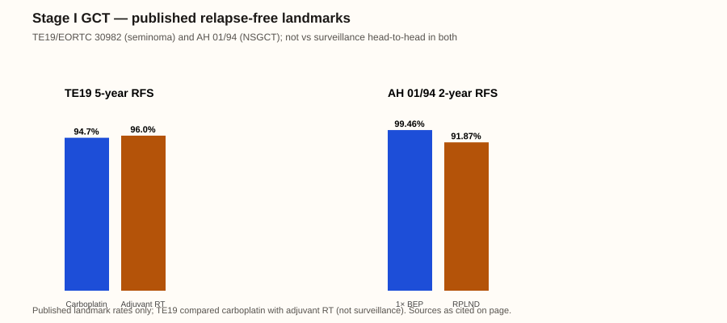

# Testis → Clinical stage I germ-cell tumor

Last reviewed: 2026-09-23
Next review: 2026-12-22
Owner: GU clinic
Purpose: Shared decision support after orchiectomy for clinical stage I seminoma or nonseminomatous germ-cell tumor
Status: current — surveillance is preferred when reliable follow-up is feasible; adjuvant treatment reduces relapse but does not establish a survival advantage over surveillance

## Who this applies to

| Population | Definition | Boundary |
|---|---|---|
| Clinical stage I seminoma | Pure seminoma after orchiectomy, normalizing markers, and no metastasis on conventional staging[^4][^5]. | Elevated AFP should be managed as nonseminoma/mixed GCT, not pure seminoma[^4]. |
| Clinical stage I NSGCT | Negative conventional staging with normalized post-orchiectomy markers[^4][^5]. | Persistently rising AFP or hCG is occult systemic disease, not a surveillance/adjuvant population[^4]. |
| Shared requirements | Fertility preservation, contralateral testis assessment, pathology review, and follow-up feasibility[^4][^5]. | IGCCCG prognosis groups apply to metastatic disease, not stage I[^4]. |

## Standard options

| Clinical context | Option | Key inclusion | Typical course |
|---|---|---|---|
| Stage I seminoma | Surveillance[^2][^4] | Feasible cross-sectional imaging and marker follow-up[^2][^4]. | Guideline-directed surveillance[^4][^6]. |
| Stage I seminoma selecting adjuvant therapy | One carboplatin AUC 7 cycle[^1] | Recurrence-reduction option after shared decision-making[^1][^4]. | One cycle[^1]. |
| Stage I NSGCT, especially LVI-positive or surveillance unsuitable | One BEP cycle[^3] | LVI is the best-validated relapse risk factor[^4]. | One cycle[^3]. |
| Highly selected stage I NSGCT | Primary nerve-sparing RPLND[^3][^4] | Specialist-center surgery; consider contraindication to chemotherapy or teratoma with somatic-type malignancy[^4][^5]. | Procedure plus structured surveillance[^4]. |

## Therapy sequencing

| Post-orchiectomy setting | Treatment order | Evidence boundary |
|---|---|---|
| Stage I seminoma with reliable follow-up | Surveillance[^2][^4]. | Adjuvant carboplatin reduces relapse but does not establish a survival advantage over surveillance[^1][^4]. |
| Stage I seminoma selecting relapse reduction | One carboplatin AUC 7 cycle → structured surveillance[^1]. | TE19 compares carboplatin with radiotherapy, not surveillance[^1]. |
| Stage I NSGCT, especially LVI-positive or surveillance unsuitable | One BEP cycle → structured surveillance[^3]. | The cited randomized trial compares one BEP cycle with RPLND, not either approach with surveillance[^3]. |
| Highly selected NSGCT | Primary nerve-sparing RPLND → structured surveillance or pathology-directed management[^3][^4]. | Center expertise and pathology matter; do not apply an RPLND strategy to seminoma[^4]. |

## Surveillance and treatment de-escalation

#### Seminoma CS I (surveillance or after adjuvant carboplatin/RT)[^4]

| Modality | Year 1 | Year 2 | Year 3 | Years 4–5 | After 5 years |
|---|---|---|---|---|---|
| Tumour markers ± visit[^4] | 2× | 2× | 2× | 1× | Survivorship plan[^4] |
| Chest X-ray[^4] | — | — | — | — | — |
| Abdominopelvic MRI/CT[^4] | 2× | 2× | Once at 36 mo | Once at 60 mo | — |

#### NSGCT CS I on active surveillance[^4]

| Modality | Year 1 | Year 2 | Year 3 | Years 4–5 | After 5 years |
|---|---|---|---|---|---|
| Tumour markers ± visit[^4] | 4× (minority suggest 6× if LVI+)[^4] | 4× | 2× | 1–2× | Survivorship plan[^4] |
| Chest X-ray[^4] | 2× | 2× | Once if LVI+ | At 60 mo if LVI+ | — |
| Abdominopelvic MRI/CT[^4] | 2× | At 24 mo (+18 mo if LVI+ per majority)[^4] | Once at 36 mo | Once at 60 mo | — |

| Phase | Stop, hold, or de-escalate | Re-escalation / next line |
|---|---|---|
| Surveillance (preferred when feasible)[^2][^4] | No further adjuvant treatment after orchiectomy when surveillance selected[^4]. | Marker rise or imaging relapse → BEP or EP per metastatic/stage II pathway; refer to germ-cell center[^4][^6]. |
| One-cycle adjuvant (carboplatin or BEP)[^1][^3] | Single adjuvant cycle completes treatment; do not extend without relapse[^1][^3]. Markers and imaging per EAU post-adjuvant schedules above[^4]. | Relapse → standard metastatic GCT chemotherapy per IGCCCG group[^4]. |

- Adjuvant carboplatin or one BEP reduces relapse but does not establish survival benefit over surveillance in the cited trials[^1][^3].

Published landmark relapse-free rates only (TE19 5-year RFS; AH 01/94 2-year RFS); not full KM reconstructions; TE19 compared carboplatin with adjuvant RT, not surveillance[^1][^3].

## Landmark evidence

<!-- .cross_trial -->
| Trial | Population | Intervention | Comparator | Primary endpoint | Clinically meaningful outcomes | Generalizability-critical differences |
|---|---|---|---|---|---|---|
| [TE19/EORTC 30982](https://pubmed.ncbi.nlm.nih.gov/21282539/), N=1,447 | Unselected stage I seminoma[^1] | Carboplatin AUC 7[^1] | Adjuvant radiotherapy[^1] | Relapse-free rate[^1] | Five-year relapse-free rate 94.7% vs 96.0%; HR 1.25 (90% CI 0.83–1.89)[^1]. | Does not compare carboplatin with surveillance or prove survival benefit[^1]. |
| [TRISST](https://pmc.ncbi.nlm.nih.gov/articles/PMC7614664/), N=669 | Stage I seminoma, normal AFP/hCG, no planned adjuvant therapy[^2] | MRI surveillance or reduced scan schedule[^2] | CT surveillance or standard scan schedule[^2] | Advanced relapse[^2] | Six-year advanced relapse 0.6% MRI vs 2.6% CT; five-year OS ≥98% in every arm[^2]. | Imaging/surveillance trial, not adjuvant-treatment comparison[^2]. |
| [AH 01/94](https://pubmed.ncbi.nlm.nih.gov/18458040/), N=382 | Unselected stage I NSGCT[^3] | One BEP cycle[^3] | RPLND[^3] | Two-year recurrence-free survival[^3] | 99.46% vs 91.87%[^3]. | Does not compare either strategy with surveillance; RPLND outcomes vary by center expertise[^3]. |

## Biomarkers

| Marker | Current clinic role | Emerging / investigational | How it changes decision now | Limits |
|---|---|---|---|---|
| Lymphovascular invasion (NSGCT) | Best-validated relapse-risk factor for stage I NSGCT[^4] | — | Favors shared discussion of one BEP vs surveillance when LVI+; EAU estimates relapse about 15% without LVI and up to 50% with LVI[^3][^4]. | Shared decision, not a survival mandate for adjuvant therapy[^4]. |
| Tumor size / rete testis invasion (seminoma) | Prognostic discussion only[^5] | — | May inform counseling intensity; do not use as a stand-alone management rule[^5]. | AUA advises against stand-alone management based on these features[^5]. |
| AFP, hCG, LDH | Staging confirmation and surveillance follow-up[^4] | — | Persistently rising AFP/hCG after orchiectomy is occult systemic disease, not a stage I surveillance/adjuvant population; elevated AFP rules out pure seminoma[^4]. | Pre-orchiectomy values alone do not define metastatic IGCCCG groups[^4]. |
| miR-371a-3p | Not standard for surveillance decisions[^8][^9] | [MAGESTIC](https://clinicaltrials.gov/study/NCT06060873) and observational cohorts testing relapse detection[^8][^9] | Do not replace imaging or standard markers outside a study[^8][^9]. | Not practice-ready as a treatment-selection assay on this page[^8][^9]. |

## Gene and cellular therapy

No FDA-approved CAR-T, TCR-T, TIL, or gene-edited cell product is standard for stage I germ-cell tumor on this page[^4][^6]. Surveillance, adjuvant carboplatin, or RPLND pathways on this page are not gene or cellular therapy[^4][^6]. CLDN6 CAR-T programs (e.g., BNT211-01, NCT04503278) enroll relapsed/refractory advanced CLDN6-positive disease — not stage I adjuvant care[^10].

| Role | Content |
|---|---|
| Current / approved clinic role | None for stage I GCT[^4][^6]. |
| Emerging / investigational | No verified stage I gene/cellular practice-changing program; cellular-therapy trials are for relapsed/refractory metastatic settings[^10]. |

## Upcoming research

Field direction: miR-371 assays are the main surveillance research track that could change relapse detection and adjuvant decision timing in stage I disease[^8][^9].

| Trial or publication | Why it may change care | Evidence status |
|---|---|---|
| [MAGESTIC](https://clinicaltrials.gov/study/NCT06060873) | Tests miR-371 in stage I surveillance and suspected regional disease[^8]. | Recruiting phase 2; no treatment-changing outcomes[^8]. |
| [Belge et al.](https://pubmed.ncbi.nlm.nih.gov/37967143/) | Prospective observational miR-371 surveillance cohort may inform future relapse detection[^9]. | Peer-reviewed observational report; not a treatment-selection standard[^9]. |

## Toxicity

| Regimen and comparator | Trial-level safety outcomes | Selected named toxicities | Counseling focus |
|---|---|---|---|
| One BEP versus RPLND, long-term AH 01/94 questionnaire | Selected follow-up questionnaire data, not a contemporary regimen-wide estimate[^3]. | Peripheral neuropathy 16% vs 12%; retrograde ejaculation 9% vs 24%[^3]. | Discuss neuropathy, hearing/renal and pulmonary risks from chemotherapy, and ejaculation/fertility effects from surgery; preserve fertility before treatment[^3][^4]. |
| Carboplatin or modern adjuvant radiotherapy for stage I seminoma | No eligible primary-paper named-event table >5% was retrieved[^1]. | Do not add unverified rates[^1]. | Counsel qualitatively on acute treatment effects; radiotherapy has later second-malignancy concern and long-term single-carboplatin safety data remain less mature[^1][^4]. |

### On-treatment monitoring

| SOC/option regimen | Hallmark monitoring toxicity and available rate | Patient action / clinic response |
|---|---|---|
| One carboplatin AUC 7 cycle | A comparable named-event rate was not retrieved from the eligible primary paper[^1]. | Check CBC and renal function and review fever/infection symptoms, bruising/bleeding, nausea/vomiting, and new hearing/neuropathy symptoms; fever, bleeding, or uncontrolled vomiting needs prompt contact[^1][^4]. |
| One BEP cycle | AH 01/94 follow-up questionnaire: peripheral neuropathy 16% vs 12% after RPLND; this is long-term selected follow-up, not a contemporary regimen-wide rate[^3]. | Check CBC, renal function, hearing, neuropathy, pulmonary symptoms, and fertility plan; fever, dyspnea, new/worsening numbness, reduced urine output, or severe vomiting needs prompt contact[^3]. |
| Primary nerve-sparing RPLND | AH 01/94: retrograde ejaculation 24% vs 9% after one BEP cycle[^3]. | Review urinary, sexual/ejaculatory, fertility, wound, and thrombotic symptoms; fever, wound concerns, urinary retention, or severe pain needs prompt contact[^3]. |
| Adjuvant radiotherapy, when selected | A comparable named-event rate was not retrieved from the eligible primary paper[^1]. | Review acute bowel, fatigue, and skin symptoms and late survivorship concerns; persistent vomiting, dehydration, severe bowel symptoms, or bleeding needs prompt contact[^1][^4]. |

## Guideline references

- [EAU Testicular Cancer guideline](https://uroweb.org/guidelines/testicular-cancer/chapter/disease-management)
- [AUA Early-Stage Testicular Cancer guideline](https://www.auanet.org/guidelines-and-quality/guidelines/testicular-cancer-guideline)
- [NCCN Testicular Cancer](https://www.nccn.org/guidelines/guidelines-detail?category=1&id=1468)
- [ESMO–EURACAN guideline](https://pubmed.ncbi.nlm.nih.gov/35065204/)

## Sources

1. [Oliver et al. (2011). TE19/EORTC 30982. *Journal of Clinical Oncology*. PMID: 21282539](https://pubmed.ncbi.nlm.nih.gov/21282539/)
2. [Joffe et al. (2022). TRISST. *Journal of Clinical Oncology*.](https://pmc.ncbi.nlm.nih.gov/articles/PMC7614664/)
3. [Albers et al. (2008). AH 01/94. *Journal of Clinical Oncology*. PMID: 18458040](https://pubmed.ncbi.nlm.nih.gov/18458040/)
4. [EAU Testicular Cancer guideline](https://uroweb.org/guidelines/testicular-cancer/chapter/disease-management)
5. [AUA Early-Stage Testicular Cancer guideline](https://www.auanet.org/guidelines-and-quality/guidelines/testicular-cancer-guideline)
6. [NCCN Testicular Cancer](https://www.nccn.org/guidelines/guidelines-detail?category=1&id=1468)
7. [ESMO–EURACAN guideline](https://pubmed.ncbi.nlm.nih.gov/35065204/)
8. [MAGESTIC](https://clinicaltrials.gov/study/NCT06060873)
9. [Belge et al. (2023). miR-371 surveillance cohort. PMID: 37967143](https://pubmed.ncbi.nlm.nih.gov/37967143/)

10. [ClinicalTrials.gov NCT04503278 (BNT211-01 / CLDN6 CAR-T ± RNA-LPX)](https://clinicaltrials.gov/study/NCT04503278)

## Changelog
- 2026-09-23: Added Gene and cellular therapy section (after Biomarkers, before Upcoming research); clinic vs investigational framing; no approved GU solid-tumor CAR-T/TCR/TIL products in these settings.
- 2026-09-22: Replaced vague surveillance with EAU minimal follow-up tables for seminoma and NSGCT CS I; added published RFS landmark figure; expanded Biomarkers to five-column table; mirrored marker/imaging cadence in paired dotphrase.
- 2026-09-22: Renamed Upcoming trial results to Upcoming research; reframed for ongoing trials and field direction.
- 2026-09-22: Named comparator arms in paired dotphrase counseling for efficacy/toxicity rates.
- 2026-09-22: Added line-level source superscripts ([^n]) linked to numbered Sources.
- 2026-09-22: Added Surveillance and treatment de-escalation section; strengthened quantified benefit counseling in dotphrase.

- 2026-09-21: Added stage-I treatment sequencing and monitoring tables for surveillance alternatives, chemotherapy, radiotherapy, and RPLND.
- 2026-09-21: Created stage I seminoma and NSGCT reference with explicit surveillance, adjuvant, and fertility boundaries.
